# JuicyDocs


A modern, fast, and accessible documentation starter template built with [Eleventy](https://www.11ty.dev/) and [Tailwind CSS](https://tailwindcss.com/).

**[View Demo](https://juicydocs.freshjuice.dev)**

## Screenshots

### Desktop

| Light Mode | Dark Mode |
|------------|-----------|
| 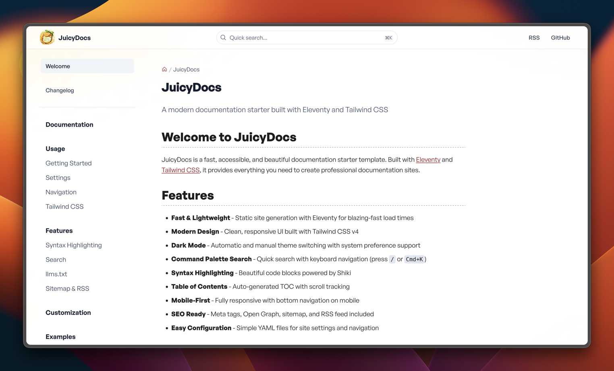 | 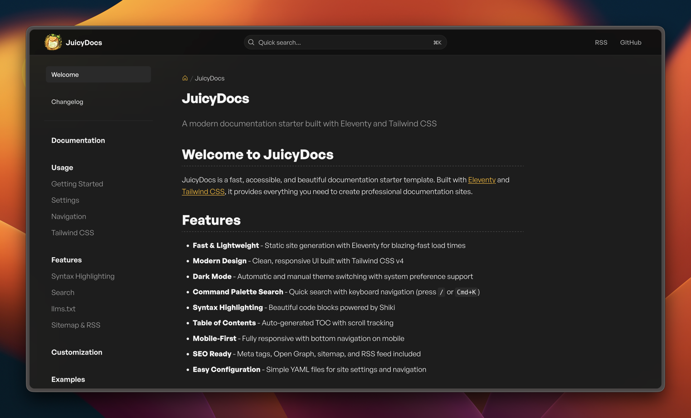 |
| 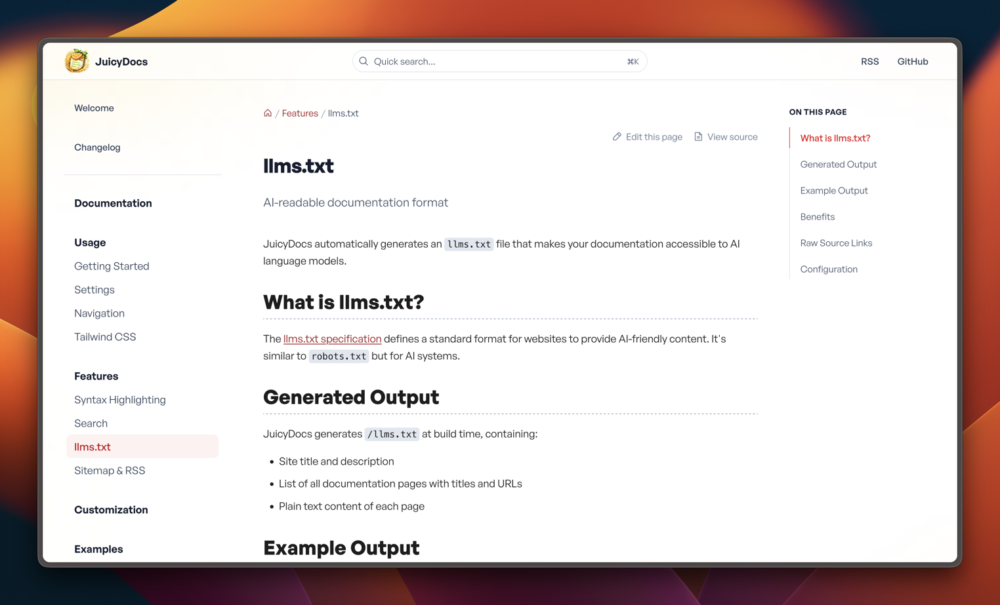 | 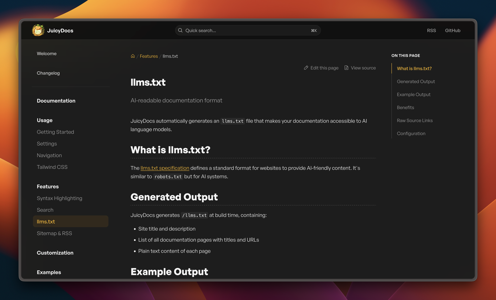 |
| 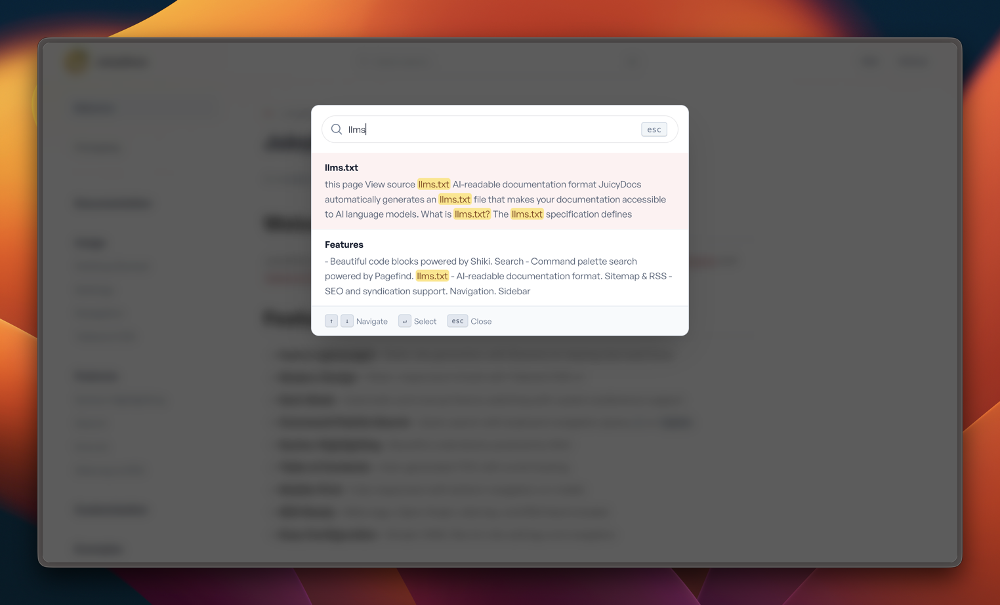 | 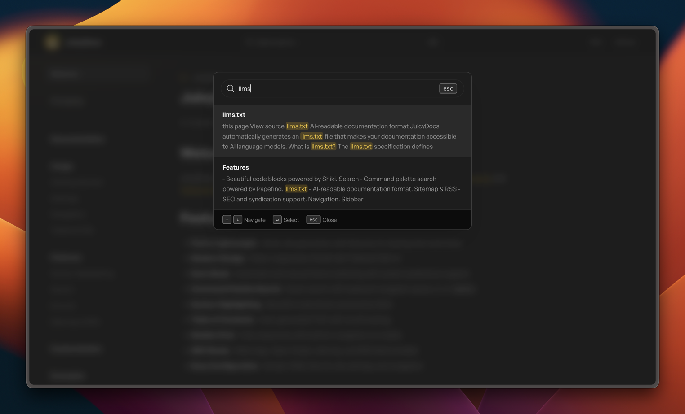 |

### Mobile

| Light Mode | Dark Mode |
|------------|-----------|
| 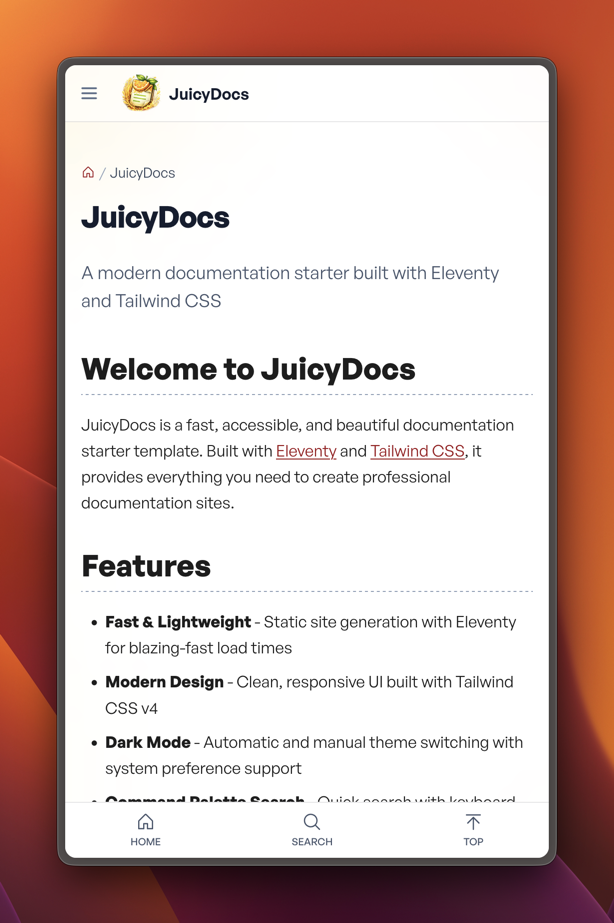 | 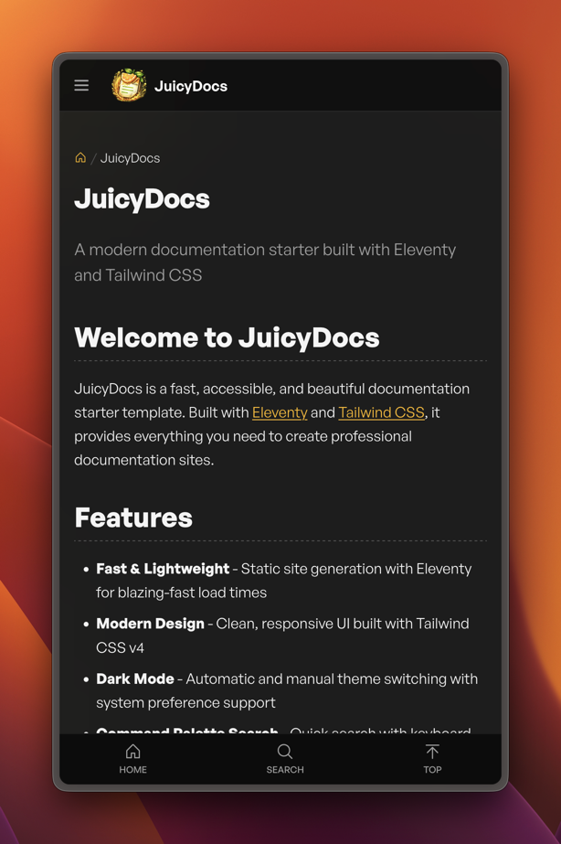 |
| 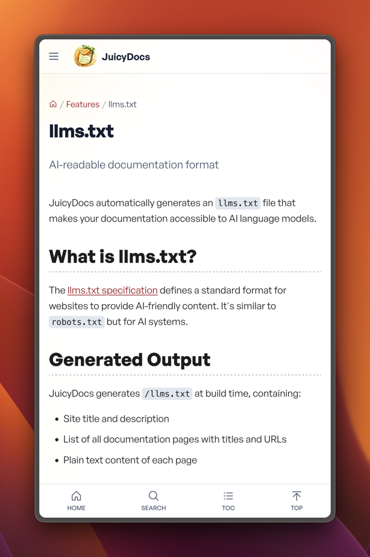 | 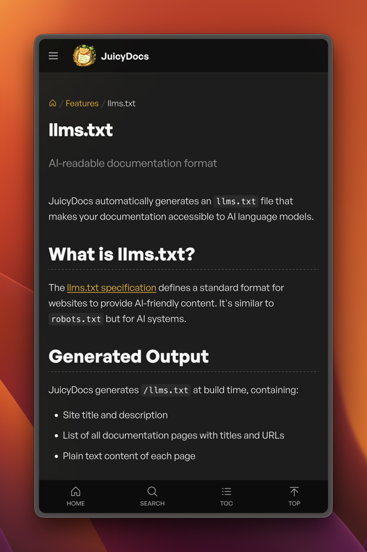 |
|  | 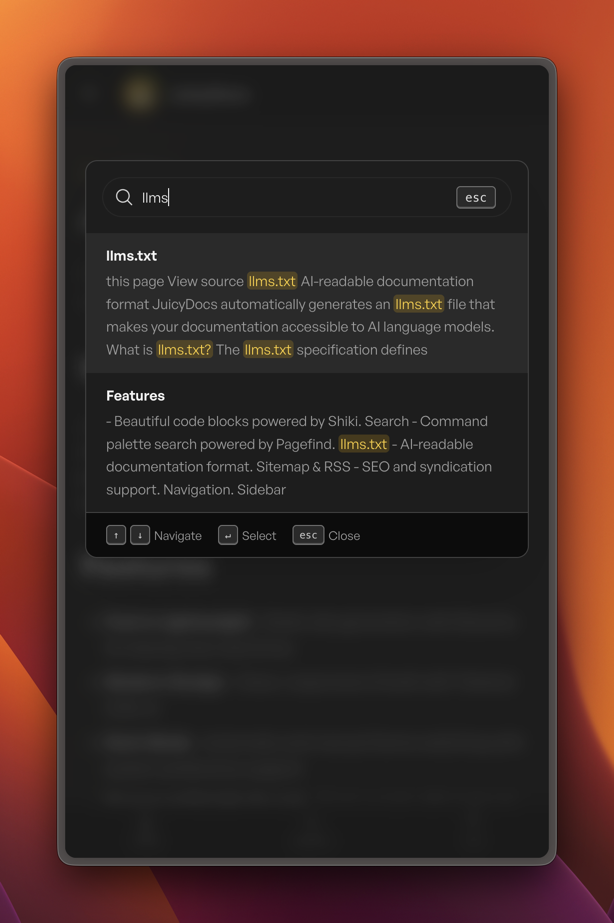 |

## Features

- **Fast** - Static site generation with Eleventy v3
- **Modern Styling** - Tailwind CSS v4 with dark mode support
- **Search** - Command palette search powered by Pagefind
- **Syntax Highlighting** - Beautiful code blocks with Shiki
- **Responsive Tables** - Auto-wrapped with table-saw for mobile
- **Lazy YouTube Embeds** - lite-youtube-embed for fast page loads
- **Accessible** - Keyboard navigation, focus states, WCAG compliant
- **SEO Ready** - Sitemap, RSS, Open Graph, Twitter Cards
- **AI Ready** - llms.txt for AI-readable documentation

## Quick Start

```bash
# Clone the repository
git clone https://github.com/freshjuice-dev/juicydocs-11ty-starter.git
cd juicydocs-11ty-starter

# Install dependencies
npm install

# Start development server
npm run dev

# Build for production
npm run build
```

## Requirements

- Node.js 24+ (see `.nvmrc`)

## Project Structure

```
├── config/             # Eleventy configuration modules
│   ├── collections.js  # Custom collections
│   ├── filters.js      # Template filters
│   ├── plugins.js      # Eleventy plugins
│   ├── shortcodes.js   # Custom shortcodes
│   └── transforms.js   # Output transforms
├── src/
│   ├── _data/          # Global data files
│   ├── _includes/      # Layouts and partials
│   ├── assets/         # CSS, JS, fonts, images
│   └── content/        # Documentation content (Markdown)
└── _site/              # Build output (generated)
```

## Writing Documentation

Create Markdown files in `src/content/docs/` with front matter:

```yaml
---
title: Page Title
description: Page description for SEO
eleventyNavigation:
  key: Page Title
  parent: Parent Page  # optional, for nesting
  order: 10            # optional, for sorting
---

Your content here...
```

## Available Shortcodes

### Alerts

```nunjucks


```

Types: `info`, `warning`, `success`, `danger`

### YouTube (Lazy Loading)

```nunjucks


```

### Embed (iframes)

```nunjucks

```

## Configuration

Edit `src/_data/metadata.yaml` for site settings:

```yaml
title: Your Site Name
description: Your site description
url: https://your-site.com
language: en
author: Your Name
email: contact@your-site.com
twitter: "@YourTwitter"
ogImage: /og-default.png
```

Edit `src/_data/navigation.yaml` for navigation links.

## Scripts

| Command | Description |
|---------|-------------|
| `npm run dev` | Start development server at localhost:8080 |
| `npm run build` | Build for production |
| `npm run clean` | Remove build artifacts |

## Deployment

JuicyDocs generates static files in `_site/`. Deploy to any static hosting:

- **Netlify** - `_redirects` and `_headers` included
- **Cloudflare Pages** - Same files work here too
- **Vercel**, **GitHub Pages**, etc.

For production builds with minification:

```bash
ELEVENTY_ENV=production npm run build
```

## Credits

### Libraries & Tools

- [Eleventy](https://www.11ty.dev/) - Static site generator
- [Tailwind CSS](https://tailwindcss.com/) - Utility-first CSS
- [Pagefind](https://pagefind.app/) - Static search
- [Shiki](https://shiki.style/) - Syntax highlighting
- [Phosphor Icons](https://phosphoricons.com/) - Icon set
- [General Sans](https://www.fontshare.com/fonts/general-sans) - Typography
- [lite-youtube-embed](https://github.com/nicholashudson/lite-youtube-embed) - Lazy YouTube
- [table-saw](https://github.com/zachleat/table-saw) - Responsive tables

### Images

Sample images from [Pexels](https://www.pexels.com/) (free to use):

| Image | Photographer | Link |
|-------|--------------|------|
| `pexels-jsalamanca-61127.jpg` | Juan Salamanca | [Banana](https://www.pexels.com/photo/riped-banana-61127/) |
| `pexels-nietjuhart-2820144.jpg` | Susanne Jutzeler | [Strawberries](https://www.pexels.com/photo/bowl-of-strawberry-fruits-2820144/) |
| `pexels-pixabay-51958.jpg` | Pixabay | [Orange](https://www.pexels.com/photo/orange-fruite-51958/) |
| `pexels-pixabay-52536.jpg` | Pixabay | [Raspberries](https://www.pexels.com/photo/red-raspberry-52536/) |
| `pexels-psco-27269.jpg` | Pineapple Supply Co. | [Pineapples](https://www.pexels.com/photo/two-pineapple-fruit-on-sad-near-body-of-water-27269/) |
| `pexels-wendyaffieplaas-1178610.jpg` | Wendy Aros-Routman | [Cherries](https://www.pexels.com/photo/red-cherries-on-stainless-steel-bowl-1178610/) |

## License

MIT License - see [LICENSE](LICENSE) for details.

---

Made with 🍊 by [FreshJuice](https://freshjuice.dev/)
